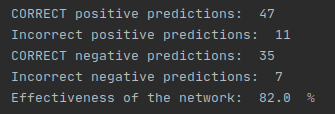

# HeartDiseasePredictor
Neural network (multilayer perceptron) predicting heart diseases based on kaggle.com data

## Table of contents
* [General info](#general-info)
* [Screenshots](#screenshots)
* [Technologies](#technologies)
* [Features](#features)
* [Status](#status)

## General info
Project realised by [@Marcel88888](https://github.com/Marcel88888) and [@ppawel11](https://github.com/ppawel11) for the subject Fundamentals of Artificial Intelligence on the Warsaw University of Technology. Our goal was to get familiar with the mode of action of neural networks and to use it in some practical way.
It was not allowed to use python artificial intelligence libraries so all algorithms are made "by hand".

## Screenshots

## Technologies
* Python 3.7

## Features
* training the neural network using training data
Learning is done using stochastic gradient descent algorithm.
* checking effectiveness of the neural network using testing data

## Status
Project is finished but we can improve our network using some artifical inteligence algorithms which can make effectiveness higher.

